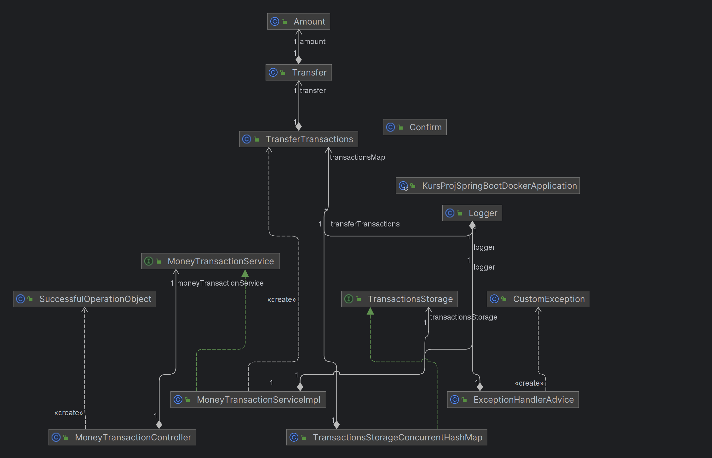

# **Курсовой проект «Сервис перевода денег»**

## Архитектура REST-приложения «Сервис перевода денег»:

- используется стандартная слоеная схема со следующими слоями: model, controller, service, storage, exception, util.
- для подключения хранилища (в данной реализации используется класс с хранилищем HashMap) и сервиса обработки сообщений используются соответствующие интерфейсы.
- логирование организовано через бин на основе класса Logger, к которому обращаются из точек логирования.
- имя файла логов и путь к нему настраиваются в application.properties.
- приложение разворачивается в Docker-контейнере с использованием compose.yaml.
- обращаться к API необходимо по адресу http://localhost:5500.

**Схема приложения:**

**Набор запросов HTTP-запросов к API для Postman:**
[Набор запросов HTTP-запросов к API для Postman](Transfer%20Money%20API.postman_collection.json)